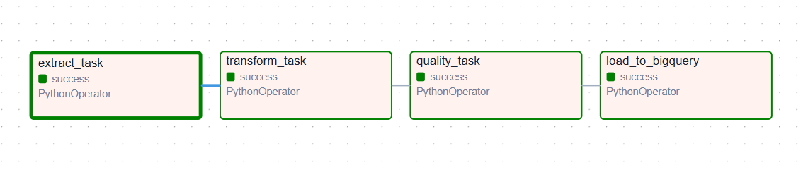
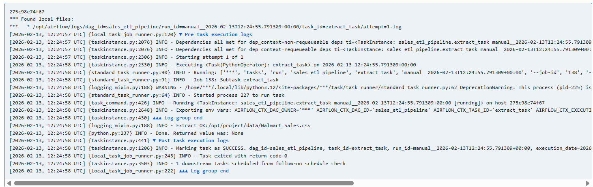
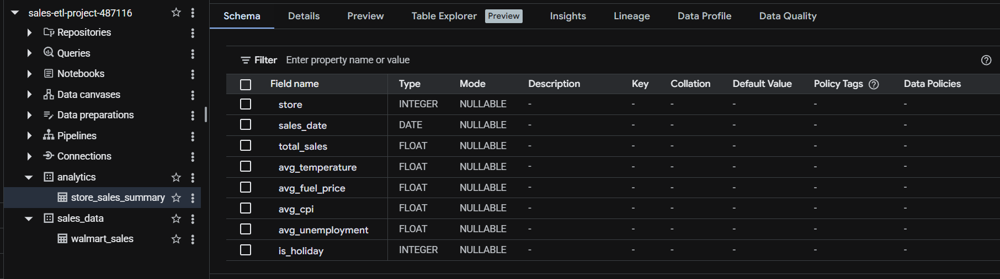
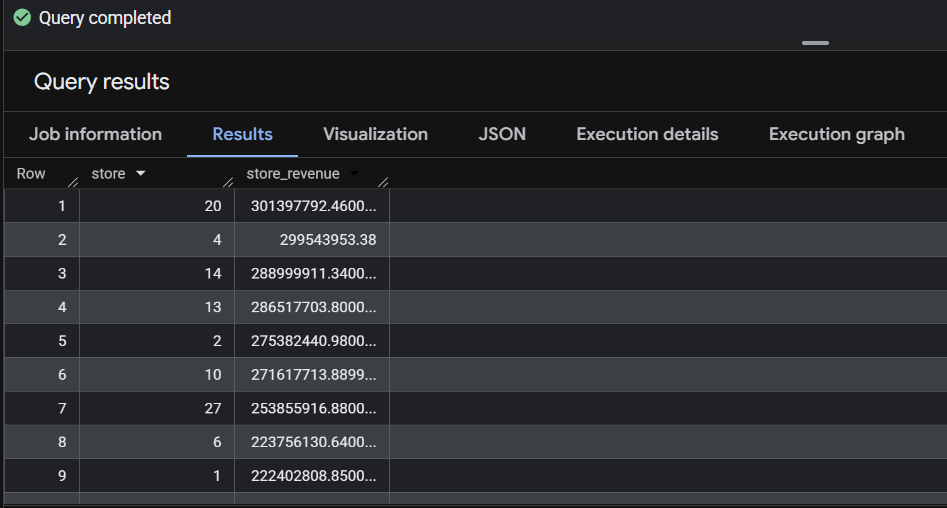

# Sales ETL Pipeline (Airflow + BigQuery)


## Project Overview
This project is an end-to-end Data Engineering ETL pipeline built using Apache Airflow and Google BigQuery.
The pipeline extracts raw Walmart sales data from a CSV file, performs cleaning and transformation operations, validates data quality, and loads the processed data into BigQuery for analytics.
The goal of this project is to simulate a real-world production data pipeline including orchestration, logging, retry handling, and analytical table creation.

## Architecture

The pipeline follows a classic ETL workflow orchestrated by Airflow:

Extract → Transform → Data Quality Check → Load → Analytics

Tasks:

1. extract_task
Reads the raw Walmart_Sales.csv file.

2. transform_task
- Parses date column
- Converts numeric columns
- Removes duplicates
- Standardizes schema

3. quality_task
Performs basic validation checks:
- Date cannot be null
- Weekly sales cannot be negative
- Required columns must exist

4. load_to_bigquery
Loads the cleaned dataset into BigQuery table:
sales_data.walmart_sales

5. analytics_query
Creates aggregated analytics table:
analytics.store_sales_summary

## Tech Stack

- Python (Pandas, Google Cloud BigQuery Client)
- Apache Airflow (DAG orchestration)
- Docker & Docker Compose (Containerized environment)
- Google Cloud Platform (BigQuery Data Warehouse)
- SQL (Analytics queries)
- ETL Pipeline Architecture


## Project Structure

```bash
sales-etl-pipeline/
│
├── airflow/
│   ├── dags/
│   │   └── sales_etl_dag.py        # Airflow pipeline definition
│   ├── logs/                       # Airflow execution logs
│   └── plugins/
│
├── scripts/
│   ├── extract.py                  # Reads raw CSV
│   ├── transform.py                # Cleans & standardizes data
│   └── load_bq.py                  # Loads data to BigQuery
│
├── data/
│   └── walmart_sales.csv           # Raw dataset
│
├── keys/
│   └── gcp_credentials.json        # Service account credentials
│
├── docker-compose.yaml             # Airflow services
└── README.md
```


##  Pipeline Workflow

The pipeline is orchestrated by Apache Airflow and processes the data in the following order:

1. Extract
Raw Walmart sales data is read from the local data directory.

2. Transform
The dataset is cleaned and standardized:
- Column names normalized
- Date converted to datetime
- Negative sales removed
- Missing values filled
- Duplicates removed

3. Data Quality Check
The pipeline validates:
- No null dates
- No negative sales values

4. Load
Only new records are appended into Google BigQuery table.

The DAG guarantees that each step runs in order and stops if any step fails.

## How to Run Locally

### 1) Clone repository
git clone https://github.com/YOUR_USERNAME/sales-etl-pipeline.git
cd sales-etl-pipeline

### 2) Set Google Cloud credentials
Create a service account in Google Cloud and download the JSON key.

Place the file inside:
`keys/gcp_credentials.json`

Then set environment variable:

**Windows (PowerShell):**
```powershell
$env:GOOGLE_APPLICATION_CREDENTIALS="keys/gcp_credentials.json"

Linux / Mac:
export GOOGLE_APPLICATION_CREDENTIALS="keys/gcp_credentials.json"

### 3) Start Airflow (Docker)
cd airflow
docker compose up -d

### 4) Open Airflow UI
http://localhost:8081

Username: airflow
Password: airflow

### 5) Trigger pipeline
Enable and run DAG:
sales_etl_pipeline

## BigQuery Tables

The pipeline creates two datasets:

### 1) Raw/Cleaned Table
sales_data.walmart_sales

Contains cleaned transactional sales data after transformation and validation steps.

### 2) Analytics Table
analytics.store_sales_summary

Aggregated table used for analytics and reporting.

Includes:
- total sales per store per day
- average temperature
- average fuel price
- average CPI
- average unemployment rate
- holiday indicator

## Example Analytical Query

Top performing stores by total revenue:

```sql
SELECT
    store,
    SUM(total_sales) AS store_revenue
FROM sales-etl-project-487116.analytics.store_sales_summary
GROUP BY store
ORDER BY store_revenue DESC
LIMIT 10;
```


This query returns the highest revenue generating stores using the analytics table produced by the ETL pipeline. 

## Screenshots

### Airflow DAG Graph


### Airflow Task Logs


### BigQuery Table Schema


### BigQuery Query Result


## What I Learned
I built a complete end-to-end data pipeline similar to a real production workflow.

During this project I learned:
	•	How ETL pipelines are designed in real data engineering systems
	•	How Apache Airflow orchestrates tasks using DAG dependencies
	•	Running Airflow inside Docker and understanding containerized environments
	•	Data cleaning and validation using Pandas (type conversion, null checks, duplicate removal)
	•	Loading data programmatically into BigQuery using Python client
	•	Writing analytical SQL queries on a data warehouse
	•	Understanding the difference between raw data tables and analytics tables
	•	Debugging pipeline failures using Airflow task logs
	•	Managing project structure like a real data engineering repository

This project helped me understand how raw data becomes analytics-ready data in a modern data platform.

## Future Improvements
There are several improvements that can make this pipeline closer to a production-grade system:
	•	Implement incremental partition loading instead of full table checks
	•	Add automated data quality alerting (email/Slack notification on failure)
	•	Store configuration variables using Airflow Variables or Secrets Manager
	•	Add unit tests for transform functions
	•	Create partitioned and clustered tables in BigQuery for better performance
	•	Add dashboard visualization (Looker Studio / Tableau)
	•	Deploy the pipeline on a cloud VM instead of local Docker environment
	•	Add CI/CD automation for DAG deployment   
